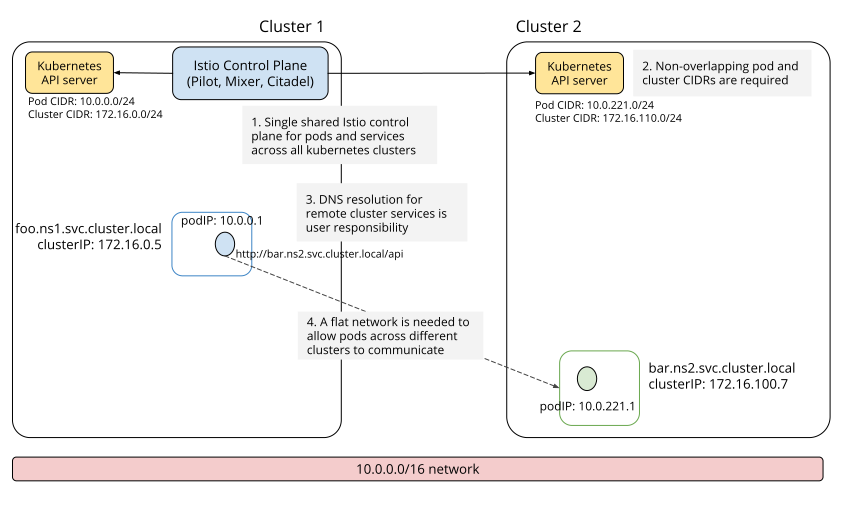

Story:
1. the dev deploy an application in the on-premise cluster, but there is no enough resource to have the application run. so the dev want to leverage the cloud resource to run this application. but the application dependency are still in on-premise cluster. it should be run smoothly.

From the openshift [release document](https://docs.openshift.com/container-platform/4.3/service_mesh/service_mesh_arch/understanding-ossm.html#ossm-understanding-service-mesh_understanding-ossm), we can see that:

Red Hat OpenShift Service Mesh gives you an easy way to create a network of deployed services that provide:
- Discovery
- Load balancing
- Service-to-service authentication
- Failure recovery
- Metrics
- Monitoring

Red Hat OpenShift Service Mesh also provides more complex operational functions including:
- A/B testing
- Canary releases
- Rate limiting
- Access control
- End-to-end authentication

Istio provides https://preliminary.istio.io/docs/setup/install/multicluster/ for three different multi-cluster scenarios: replicated control planes, shared control plane with single-network, and shared control plane with multi-network.

## Shared control plane with single-network
Follow this guide to install an Istio multicluster service mesh where the Kubernetes cluster services and the applications in each cluster have the capability to expose their internal Kubernetes network to other clusters.

In this configuration, multiple Kubernetes clusters running a remote configuration connect to a shared Istio control plane. Once one or more remote Kubernetes clusters are connected to the Istio control plane, Envoy can then form a mesh network across multiple clusters.

## Shared control plane with multi-network
Follow this guide to configure a multicluster mesh using a shared control plane with gateways to connect network-isolated clusters. Istio’s location-aware service routing feature is used to route requests to different endpoints, depending on the location of the request source.

## Replicated control planes
Instead of using a shared Istio control plane to manage the mesh, in this configuration each cluster has its own Istio control plane installation, each managing its own endpoints. All of the clusters are under a shared administrative control for the purposes of policy enforcement and security.

A single Istio service mesh across the clusters is achieved by replicating shared services and namespaces and using a common root CA in all of the clusters. Cross-cluster communication occurs over Istio gateways of the respective clusters.

Cons:
    - there is no central place to manage all traffics so far.

Pros:
    - Currently, Kiali only works with Istio's replicated control planes scenario. You will need to install Kiali aside each Istio's control plane; i.e. you will need one Kiali instance per Istio's control plane you want to monitor. Install instructions for Kiali are the same as for the single cluster scenario, so following the link:/documentation/getting-started/[Getting started guide] is enough. Kiali will let you observe the mesh portion that is managed by the adjacent control plane.

## Proposal to support shared control plane with multi-network in ACM

the following tasks we shold have to support:
1. enable the shared control plane with multi-network in installer
    - install control plane in hub cluster
    - enabled core components by default
    - have feature flags to allow enable telemetry addons components - kiali/tracing/prometheus/grafana
    - install citadel/ingress/sidecar in member cluster
2. checkout if ocp bundled istio can support this feature or not.
- [maistra-1.0.4](https://github.com/Maistra/istio/tree/maistra-1.0.4) --- istio-1.1.17
- [maistra-1.1](https://github.com/Maistra/istio/tree/maistra-1.1) --- istio-1.4
