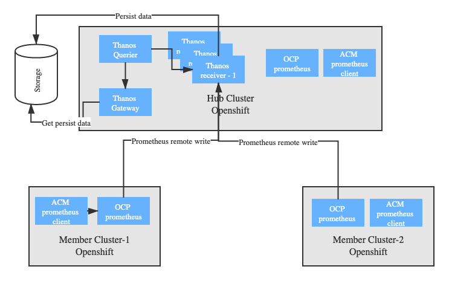

## Use Cases

As an operator, I would like to monitor the multi-cluster in a single dashboard to ensure everything is working seamlessly.

## Current implementation

### Federatd Prometheus

Federated prometheus can match the requirement a little. but the data is just aggregated data. This provides an aggregate global view and detailed local views. 

## Design

### Thanos

Thanos provides a global query view, data backup, and historical data access as its core features. All three features can be run independently of each other. This allows you to have a subset of Thanos features ready for immediate benefit or testing, while also making it flexible for gradual adoption in more complex environments. 

### Openshift 4.3 Details

There are 2 namespaces are designed for monitoring
```
openshift-monitoring
openshift-user-workload-monitoring
```
Pods in `openshift-monitoring` namespace
```
alertmanager-main-0                            3/3     Running   0          13d
alertmanager-main-1                            3/3     Running   0          13d
alertmanager-main-2                            3/3     Running   0          3d11h
cluster-monitoring-operator-7bbc9f9895-snggf   1/1     Running   1          13d
grafana-7847db887-tr82z                        2/2     Running   0          13d
kube-state-metrics-777f6bf798-vd7zs            3/3     Running   0          13d
node-exporter-dv4fm                            2/2     Running   2          13d
node-exporter-fdswb                            2/2     Running   2          13d
node-exporter-jzr4t                            2/2     Running   0          13d
node-exporter-kt6d2                            2/2     Running   0          13d
openshift-state-metrics-b6755756-8wgn6         3/3     Running   0          3d11h
prometheus-adapter-f46df5fc6-8vqw5             1/1     Running   0          12d
prometheus-adapter-f46df5fc6-f8278             1/1     Running   0          3d11h
prometheus-k8s-0                               7/7     Running   1          13d
prometheus-k8s-1                               7/7     Running   1          13d
prometheus-operator-985bf8dd5-79wh4            1/1     Running   1          13d
telemeter-client-79676668bd-jlj75              3/3     Running   0          13d
thanos-querier-8565b4dc6-jrsw2                 4/4     Running   0          3d11h
thanos-querier-8565b4dc6-nccw8                 4/4     Running   0          13d
```

Propose to deploy the seperated promethues in `openshift-user-workload-monitoring` namespace for ACM, because: 

- The OCP Grafana does not allow the user to modify or create dashbaords while we have requirements allows the user to create/import dashboards and supports the dynamic creation of dashboards by CR or by the ACM application lifecycle componentry.
- Each dashboard pulls from a different source Prometheus that are configured in slightly different ways to scrape configuration from target workloads.

### Architecture




- Prometheus will be configured to send all metrics to the Thanos Receive using remote_write.
- Thanos Receive receives the metrics sent by the different Prometheus instances and persist them into the S3 Storage.
- Thanos Store Gateway will be deployed so we can query persisted data on the S3 Storage.
- Thanos Querier will be deployed, the Querier will answer user’s queries getting the required information from the Thanos Receiver and from the Storage through the Thanos Store Gateway if needed.


## Follow up

1. Create a new repo for monitoring - 
2. Move the prometheus configuration files and grafana dashboards to open-cluster-management
3. Investigate installation by using Prometheus Operator - https://github.com/coreos/prometheus-operator/blob/master/Documentation/thanos.md
4. Performance
    - testing for 1000 clusters
    - network impacts


## Open Questions
1. Do we need to consider upgrade for IBM MCM?